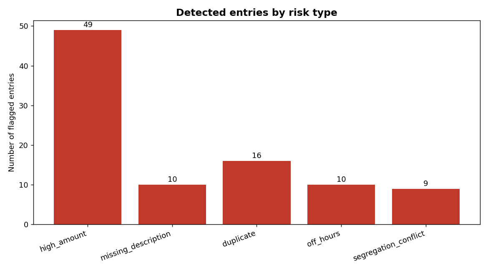
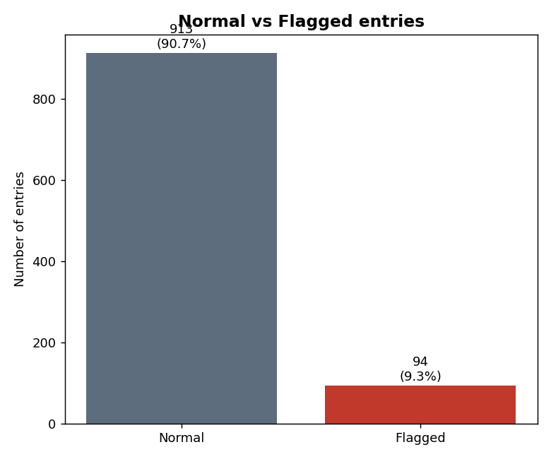

# Journal Entry Risk Detector (전표 위험 탐지기)

감사 실무의 **전표 테스트(Journal Entry Testing)** 아이디어를 파이썬으로 구현한 도구입니다.
회계 전표 데이터를 입력받아, 부정·오류의 신호가 될 수 있는 **5가지 위험지표**를 자동으로
탐지하고, 위험 전표 목록과 요약 리포트·시각화를 생성합니다.

> 감사에서 재무제표를 구성하는 최소 단위는 전표(journal entry)입니다. 대부분의 회계
> 부정은 결국 전표에 흔적을 남기므로, 전표를 규칙에 따라 훑어 이상 신호를 걸러내는 것은
> 실제 감사 절차의 핵심 중 하나입니다. 이 프로젝트는 그 절차를 작게 재현한 것입니다.

이 저장소는 ADC(조회) 인턴 당시 엑셀 조건부서식으로 조회서 오류를 자동 검출했던 경험을,
**직접 코드로 확장**해본 개인 학습 프로젝트입니다.

---

## 탐지하는 5가지 위험지표

| 위험유형 | 규칙 | 감사에서의 의미 |
|---|---|---|
| **고액 거래** (high_amount) | 금액이 통계적 이상치 상한(Q3 + 3×IQR)을 초과 | 비정상적 거액은 오류·부정 위험이 큼 |
| **설명 누락** (missing_description) | 적요(설명)가 비었거나 공백뿐 | 근거 없는 전표는 정당성 확인 필요 |
| **중복 거래** (duplicate) | 계정·금액·적요가 동일한 전표가 2건 이상 | 이중 계상·중복 지급 위험 |
| **주말/야간 기표** (off_hours) | 토·일요일 또는 업무시간 외(20시~07시) 기표 | 정상 업무 흐름을 벗어난 기록 |
| **직무분리 위반** (segregation_conflict) | 작성자와 승인자가 동일 인물 | 내부통제(직무분리) 위반 |

각 전표는 걸린 규칙 수만큼 **위험점수(risk_score)** 를 받고, 걸린 사유(risk_reasons)가 함께 기록됩니다.

---

## 실행 방법

```bash
# 1) 의존성 설치
pip install -r requirements.txt

# 2) 전체 파이프라인 실행
python main.py
```

실행하면 다음이 순서대로 수행됩니다.

1. 합성 전표 데이터 생성 → `data/journal_entries.csv`
2. 5가지 위험지표 규칙 적용
3. 위험 전표만 추출(위험점수 순) → `output/flagged_entries.csv`
4. 유형별 요약표 → `output/summary.csv`, 검증 리포트 → `output/validation.txt`
5. 시각화 차트 → `output/risk_by_type.png`, `output/normal_vs_flagged.png`

---

## 데이터에 대하여

실제 회사 전표는 공개할 수 없으므로, 감사에서 실제로 점검하는 전표 속성(계정, 금액,
적요, 작성자/승인자, 기표일시)을 본뜬 **합성 데이터**를 사용합니다. 정상 전표 약 950건
사이에 5가지 위험 유형을 의도적으로 심어 두었고(`injected_risk` 컬럼 = 정답표),
탐지 규칙은 이 정답을 **전혀 보지 않고** 오직 전표 속성만으로 판단합니다. 정답표는
마지막 검증 단계에서 "규칙이 심어둔 이상 전표를 얼마나 잡아냈는가"를 측정하는 데만
쓰입니다. 랜덤 시드를 고정해 누가 실행하든 같은 결과가 재현됩니다.

---

## 실행 결과 (예시)

전체 1,007건 중 **94건(9.3%)** 이 위험 전표로 탐지되었습니다.

| 위험유형 | 탐지건수 |
|---|---|
| 고액 거래 | 49 |
| 설명 누락 | 10 |
| 중복 전표 | 16 |
| 주말/야간 기표 | 10 |
| 직무분리 위반 | 9 |

검증 결과, 의도적으로 심어둔 이상 전표 57건을 **모두 탐지(재현율 100%)** 했습니다.
정상 전표 중 37건이 추가로 규칙에 걸렸는데(예: 우연히 주말에 기표된 정상 전표, 분포상
자연스럽게 큰 금액 등), 이는 오류가 아니라 **감사자가 한 번 더 확인해볼 대상**입니다.




---

## 프로젝트 구조

```
journal-entry-risk-detector/
├── main.py                  # 전체 파이프라인 실행 진입점
├── requirements.txt
├── src/
│   ├── generate_data.py     # 합성 전표 데이터 생성
│   ├── risk_rules.py        # 5가지 위험지표 규칙
│   └── visualize.py         # 결과 시각화
├── data/
│   └── journal_entries.csv  # 생성된 합성 전표(실행 시 생성)
├── output/
│   ├── flagged_entries.csv  # 탐지된 위험 전표
│   ├── summary.csv          # 유형별 요약
│   ├── validation.txt       # 탐지 성능 검증 리포트
│   └── *.png                # 시각화 차트
└── docs/
    └── methodology.md       # 지표 선정 근거와 한계
```

---

## 한계와 다음 단계

이 도구는 **규칙 기반(rule-based)** 1차 스크리닝 도구입니다. 위험 신호를 걸러줄 뿐,
실제 부정 여부는 사람의 판단이 필요합니다. 규칙 임계값(예: 고액 기준)은 회사·산업에
따라 조정되어야 하며, 여기서 잡히지 않는 유형(예: 계정 간 이상 조합, 라운드 넘버 편중)은
아직 다루지 않습니다. 향후 Benford's Law 기반 첫자리 분포 검증, 이상치 탐지 모델
(Isolation Forest 등) 추가로 확장할 수 있습니다.

자세한 지표 선정 근거와 한계는 [`docs/methodology.md`](docs/methodology.md)를 참고하세요.
