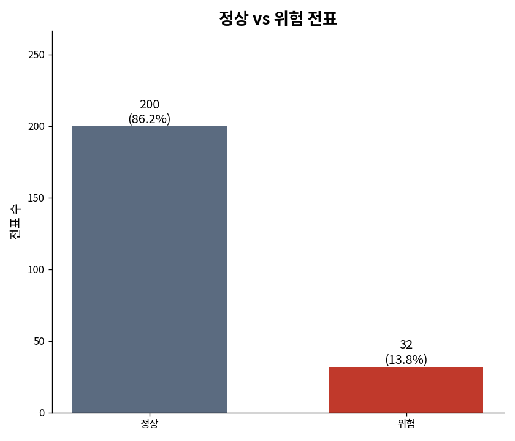
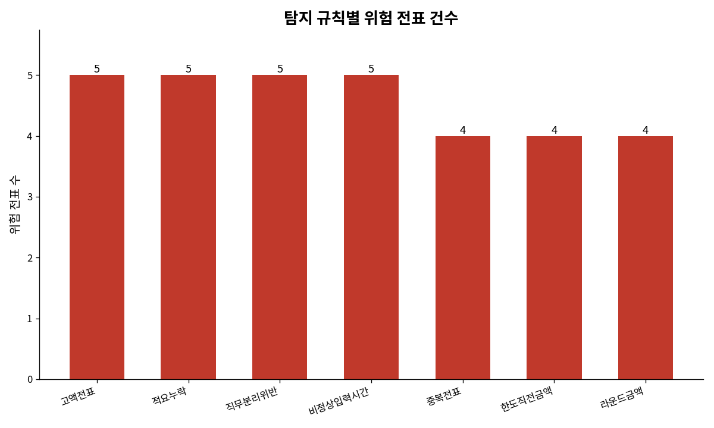

# Journal Entry Risk Detector (전표 위험 탐지기)

**감사 실무의 전표 테스트(Journal Entry Testing)를 파이썬으로 구현한 도구** — ISA 240(부정에 대한 책임) 기반 위험 기반 감사

 

---

## 프로젝트 개요

감사에서 재무제표를 구성하는 최소 단위는 **전표(journal entry)**입니다. 대부분의 회계 부정은 결국 전표에 흔적을 남기므로, 전표를 규칙에 따라 훑어 이상 신호를 걸러내는 것은 실제 감사 절차의 핵심 중 하나입니다. 이 프로젝트는 그 절차를 작게 재현한 것입니다.

회계 전표 데이터를 입력받아, 부정·오류의 신호가 될 수 있는 **7가지 위험지표**를 자동으로 탐지하고, 위험 전표 목록과 요약 리포트·시각화를 생성합니다.

> 이 저장소는 **CPA 수험 과정에서 학습한 전표 테스트(Journal Entry Testing, JET)** 개념을, 실제 데이터와 코드로 직접 구현해본 개인 학습 프로젝트입니다.

### 핵심 기능

- ✅ **7가지 이상탐지 규칙** 자동 실행
- ✅ **규칙별 가중치** 기반 위험 점수 산출
- ✅ **HTML 대시보드 리포트** 생성 (즉시 검토 가능한 형태)
- ✅ **시각화 차트**(PNG) 생성 (정상 vs 위험, 규칙별 건수)
- ✅ **정밀도/재현율** 평가 (성능 검증)
- ✅ **단위테스트** (규칙의 논리적 정확성 증명)
- ✅ **생성형 AI(Gemini) 연동** — 플래그된 전표마다 자연어 감사 코멘트 자동 생성

---

## 감사 실무와의 연결

### 전통적 감사 vs 위험 기반 감사

| 항목 | 전통적 방식 | 위험 기반 방식 (본 프로젝트) |
|------|----------|------------------------|
| 전표 검토 | 무작위 표본 추출 | **위험 점수 높은 순** 우선 검토 |
| 시간 배분 | 균등 배분 | **위험도에 따라** 집중 |
| 효율성 | 낮음 (많은 시간 소요) | **높음** (부정 위험에 집중) |
| ISA 기준 | ISA 330 | **ISA 240** (부정 위험) |

### 탐지하는 7가지 위험지표

| # | 규칙 | 가중치 | 감사에서의 의미 |
|---|------|--------|---------|
| 1 | **고액전표** | 3 | 승인 한도를 초과하는 거래 → 비정상 거래 가능성 |
| 2 | **직무분리위반** | 3 | 입력자 = 승인자 → 견제·감시 불가능 (내부통제 위반) |
| 3 | **중복전표** | 2 | 동일 거래 중복 기표 → 이중 계상·중복 지급 위험 |
| 4 | **비정상입력시간** | 2 | 주말·심야 입력 → 정상 업무 흐름을 벗어난 기록 |
| 5 | **한도직전금액** | 2 | 승인 한도 바로 아래 → 규제 회피 의심 |
| 6 | **라운드금액** | 1 | 1천만 단위 정수 반복 → 추정치·조작 가능성 |
| 7 | **적요누락** | 1 | 거래 설명 부재 → 근거 없는 전표, 정당성 확인 필요 |

각 전표는 걸린 규칙들의 **가중치 합만큼 위험점수(risk_score)**를 받고, 걸린 사유가 함께 기록됩니다.
→ **점수가 높을수록 우선 검토**

---

## 설치 및 사용

```bash
# 1) 의존성 설치
pip install -r requirements.txt

# 2) 단계별 실행
python3 src/loader.py     # ① 데이터 로드 & 기초 점검
python3 src/scorer.py     # ② 위험 점수 산출
python3 src/report.py     # ③ HTML 대시보드 생성
python3 src/charts.py     # ④ 시각화 차트(PNG) 생성
python3 src/evaluate.py   # ⑤ 탐지 성능 평가
```

결과물:
- `reports/risk_report.html` — HTML 대시보드 (브라우저에서 열기)
- `reports/chart_normal_vs_flagged.png`, `reports/chart_by_risk_type.png` — 시각화 차트

---

## 데이터에 대하여

실제 회사 전표는 공개할 수 없으므로, 감사에서 실제로 점검하는 전표 속성(계정, 금액, 적요, 작성자/승인자, 기표일시)을 본뜬 **합성 데이터**를 사용합니다. 정상 전표 약 200건 사이에 7가지 위험 유형을 의도적으로 심어 두었고(`is_anomaly` 컬럼 = 정답표), 탐지 규칙은 이 정답을 **전혀 보지 않고** 오직 전표 속성만으로 판단합니다. 정답표는 마지막 검증 단계에서 "규칙이 심어둔 이상 전표를 얼마나 잡아냈는가"를 측정하는 데만 쓰입니다. 랜덤 시드를 고정해 누가 실행하든 같은 결과가 재현됩니다.

---

## 실행 결과

전체 **232건 중 32건(13.8%)**이 위험 전표로 탐지되었습니다.

| 위험유형 | 탐지건수 |
|---------|--------|
| 고액전표 | 5 |
| 적요누락 | 5 |
| 직무분리위반 | 5 |
| 비정상입력시간 | 5 |
| 중복전표 | 4 |
| 한도직전금액 | 4 |
| 라운드금액 | 4 |

### 성능 평가 (혼동행렬)

```
참양성(TP, 맞게 찾음)    : 32 건
거짓양성(FP, 오탐)      : 0 건
거짓음성(FN, 미탐)      : 0 건

정밀도(Precision)  : 100.0%
재현율(Recall)     : 100.0%
F1-Score          : 1.000
```

---

## 시각화 결과

### 정상 vs 위험 전표


### 탐지 규칙별 위험 전표 건수


> 위 차트는 `src/charts.py`로 생성됩니다.
> 인터랙티브 대시보드는 `reports/risk_report.html`을 브라우저에서 열어 확인할 수 있습니다.

---

## AI 설명 기능 (생성형 AI 연동)

규칙은 "어떤 전표가 위험한지"만 플래그합니다. 여기에 생성형 AI(Google Gemini)를 연동해, 플래그된 전표마다 **왜 위험한지, 감사인이 무엇을 우선 확인해야 하는지**를 자연어 감사 코멘트로 자동 생성하는 기능을 추가했습니다.

```bash
export GEMINI_API_KEY="본인의 키"
python3 src/ai_explainer_run.py
```

### 실행 결과 예시

위험점수 상위 전표에 대해 실제로 생성된 AI 설명입니다. (전체 결과는 `reports/ai_explanations.csv` 참고)

**JE00201 (지급수수료 5억원, 고액전표)**
> "실체가 없는 가공의 용역을 빌미로 자금을 유출했거나 리베이트 등 부적절한 용도로 집행되었을 위험이 있어... 용역 계약서와 최종 결과 보고서를 확보하여 대조 확인해야 합니다."

**JE00205 (급여 8억원, 현금 지급)**
> "가공의 급여 계상을 통한 자금 유출이나 횡령의 위험이 매우 크므로... 급여대장 및 내부 결재문서와 실제 은행 송금(출금) 증빙을 대조해야 합니다."

### AI 결과에서 확인한 것

생성된 설명에 나온 문서명(세금계산서, 원천징수이행상황신고서, 물품인도증 등)과 요청 논리를 직접 검토했습니다. 다만 JE00202(매출 4억원) 설명에서는, 원래 규칙이 탐지한 근거(고액전표)를 넘어 "1분기 말 매출 조기 인식 위험"까지 AI가 스스로 추론해 붙인 것을 확인했습니다. AI가 맥락(계정과목=매출)을 보고 추가 통찰을 주는 것은 장점이지만, 동시에 **규칙이 실제로 탐지한 사실과 AI가 덧붙인 추론을 구분해서 봐야 한다**는 점도 보여줍니다. AI 결과물을 그대로 신뢰하지 않고 사람이 검증해야 한다는 원칙을, 이 기능에서도 동일하게 적용했습니다.

---

## 프로젝트 구조

```
journal-entry-risk-detector/
├── data/
│   └── sample_journal_entries.csv      # 합성 전표 데이터
├── src/
│   ├── generate_sample_data.py          # 합성 전표 데이터 생성 스크립트
│   ├── loader.py                        # ① 데이터 로드 & 검증
│   ├── rules.py                         # ② 7개 탐지 규칙 모음
│   ├── scorer.py                        # ③ 위험 점수 산출
│   ├── report.py                        # ④ HTML 대시보드 생성
│   ├── charts.py                        # ⑤ 시각화 차트(PNG) 생성
│   ├── evaluate.py                      # ⑥ 성능 평가 (정밀도/재현율)
│   ├── explainer.py                     # ⑦ 생성형 AI 설명 생성 모듈
│   ├── ai_explainer_run.py              # ⑧ AI 설명 실행 스크립트
│   └── practice.py                      # 연습 스크립트
├── tests/
│   └── test_rules.py                    # 규칙 단위테스트 (11개)
├── reports/
│   ├── risk_report.html                 # 📊 HTML 대시보드
│   ├── chart_normal_vs_flagged.png      # 정상 vs 위험 차트
│   ├── chart_by_risk_type.png           # 규칙별 건수 차트
│   └── ai_explanations.csv              # AI가 생성한 전표별 감사 코멘트
├── docs/
│   └── 커밋_로드맵.md                    # 개발 단계별 커밋 기록
├── requirements.txt
└── README.md
```

---

## 테스트 실행

```bash
$ python3 tests/test_rules.py

Ran 11 tests in 0.067s
OK
```

각 규칙이 의도대로 동작하는지, 정상 거래는 탐지되지 않는지(오탐 방지)를 11개 단위테스트로 검증합니다.

---

## 자기소개서 연결 포인트

> **"감사 실무의 전표 테스트(ISA 240)를 직접 데이터로 구현해보며, 고액·중복·비정상 입력시간·직무분리 위반 등 부정 위험 지표를 코드로 옮기고, 위험 점수 기반의 전표 우선순위 체계를 만들어 데이터 기반 감사 접근 방식을 익혔습니다. 232장의 전표 데이터에서 32장의 위험 전표를 정확히 탐지(정밀도/재현율 100%)했으며, 단위테스트와 성능 평가를 통해 규칙의 논리적 정확성을 검증했습니다."**

---

## 한계와 다음 단계

이 도구는 **규칙 기반(rule-based) 1차 스크리닝 도구**입니다. 위험 신호를 걸러줄 뿐, 실제 부정 여부는 사람의 판단이 필요합니다. 규칙 임계값(예: 고액 기준)은 회사·산업에 따라 조정되어야 하며, 여기서 잡히지 않는 유형은 아직 다루지 않습니다. 향후 **Benford's Law 기반 첫자리 분포 검증**, **이상치 탐지 모델(Isolation Forest 등)** 추가로 확장할 수 있습니다.

---

## 라이선스

MIT License

---

**이 프로젝트는 신입공인회계사의 데이터 기반 감사 역량을 보여주기 위해 만들어졌습니다.**

